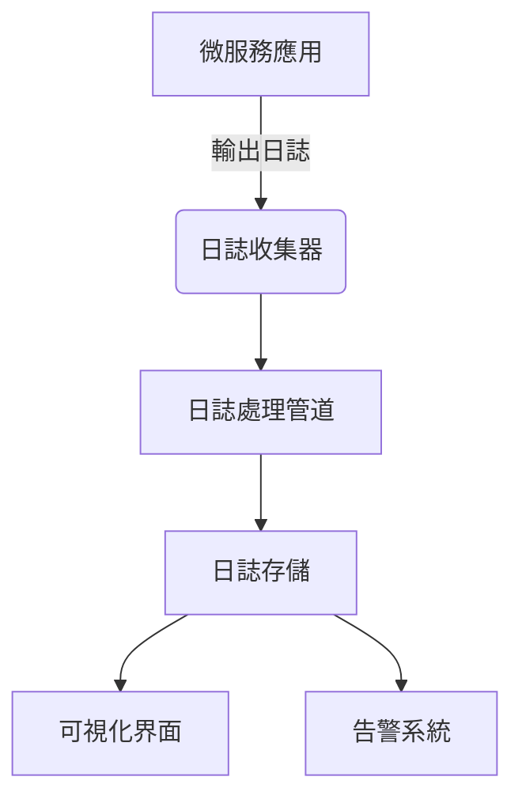

# 系統架構與模式

## 整體架構


## 日誌收集流程
1. 應用程式輸出結構化JSON日誌
2. Sidecar容器收集日誌
3. 日誌處理管道進行:
   - 格式驗證
   - 敏感資訊過濾
   - 日誌增強(添加metadata)

## 關鍵設計模式
1. **Sidecar模式**: 每個Pod部署日誌收集sidecar
2. **Pipeline模式**: 日誌處理流程分解為多個階段
3. **Publisher-Subscriber**: 日誌事件通知機制

## 組件交互
```mermaid
sequenceDiagram
    participant A as 應用服務
    participant L as 日誌收集器
    participant S as 存儲系統
    
    A->>L: 發送結構化日誌
    L->>S: 存儲處理後的日誌
    S-->>A: 日誌存儲確認(可選)
