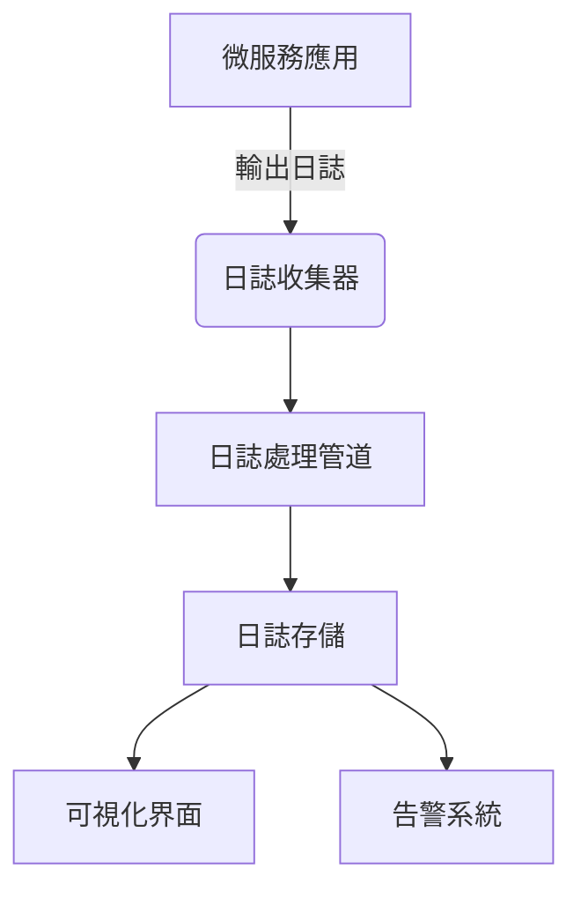

# 系統架構與模式

## 整體架構


## 日誌收集流程
1. 應用程式輸出結構化JSON日誌
2. Sidecar容器收集日誌
3. 日誌處理管道進行:
   - 格式驗證
   - 敏感資訊過濾
   - 日誌增強(添加metadata)

## 關鍵設計模式
1. **Sidecar模式**: 每個Pod部署日誌收集sidecar
2. **Pipeline模式**: 日誌處理流程分解為多個階段
3. **Publisher-Subscriber**: 日誌事件通知機制

## 組件交互
```mermaid
sequenceDiagram
    participant S as Streamlit UI
    participant PL as Python Loguru (5002)
    participant PS as Python Standard (5001)
    participant N as Node.js (3000)
    participant G as Golang
    participant J as Java
    
    S->>PL: /call_python_standard (X-Correlation-ID)
    PL->>PS: /call_node (傳遞 X-Correlation-ID)
    PS->>N: /node-hello (傳遞 X-Correlation-ID)
    N->>G: /call-golang (傳遞 X-Correlation-ID)
    G->>J: /call-java (傳遞 X-Correlation-ID)
    
    Note right of S: correlationId 由 Streamlit 生成<br/>並沿整個呼叫鏈傳遞
